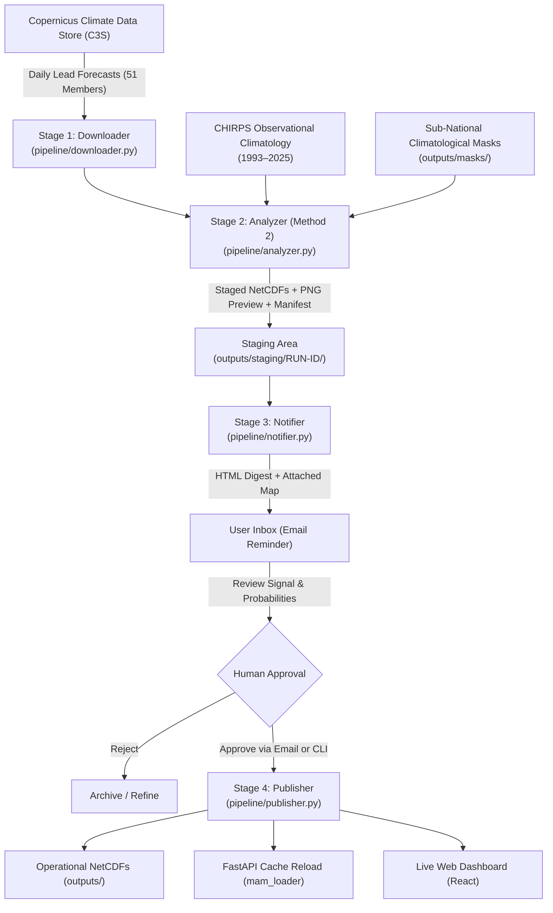

# Automated Operational Seasonal Forecasting Pipeline Guide
## Multi-Country, Multi-Season ECMWF SEAS5 Automation, Quality Review & Publishing

This guide provides complete instructions on configuring, executing, and maintaining the automated seasonal forecasting system. It covers data acquisition from Copernicus CDS, Method 2 dynamical EQM downscaling, staging, email notifications with preview maps, and human-in-the-loop approval before publishing to the operational dashboard.

---

## Table of Contents
1. [System Architecture & Workflow](#1-system-architecture--workflow)
2. [Prerequisites & Credentials Setup](#2-prerequisites--credentials-setup)
   - [Copernicus CDS API Setup (`~/.cdsapirc`)](#copernicus-cds-api-setup-cdsapirc)
   - [Email Settings in `.env` (Gmail, Outlook, Custom SMTP)](#email-settings-in-env)
3. [Supported Countries & Seasons (Registry)](#3-supported-countries--seasons-registry)
4. [How to Run the Automation Pipeline](#4-how-to-run-the-automation-pipeline)
   - [Basic Commands](#basic-commands)
   - [CLI Options & Flags](#cli-options--flags)
   - [Execution Examples](#execution-examples)
5. [Reviewing the Staged Forecast & Email Notification](#5-reviewing-the-staged-forecast--email-notification)
   - [Email Digest Content](#email-digest-content)
   - [Local Artifacts & Previews](#local-artifacts--previews)
6. [Human-in-the-Loop Review & Approval](#6-human-in-the-loop-review--approval)
   - [Method A: Command-Line Interface (CLI)](#method-a-command-line-interface-cli)
   - [Method B: One-Click Email Link / REST API](#method-b-one-click-email-link--rest-api)
   - [What Happens Upon Approval?](#what-happens-upon-approval)
7. [Automating with Cron & Task Scheduler](#7-automating-with-cron--task-scheduler)
   - [Operational Release Calendar](#operational-release-calendar)
   - [Windows Task Scheduler (Batch / PowerShell)](#windows-task-scheduler)
   - [Linux / Cloud Cron Job](#linux--cloud-cron-job)
8. [Troubleshooting & FAQs](#8-troubleshooting--faqs)

---

## 1. System Architecture & Workflow

The pipeline is structured into 4 isolated stages to ensure scientific rigor and operational safety:



1. **Stage 1 (Downloader)**: Fetches the latest 51-ensemble-member daily precipitation forecast from ECMWF SEAS5 via CDS API.
2. **Stage 2 (Analyzer)**: Performs Method 2 Dynamical EQM downscaling against 1993–2025 CHIRPS climatology, applies sub-national scientific masks, computes rainfall terciles, and creates high-resolution map previews.
3. **Stage 3 (Notifier)**: Stages all outputs in `outputs/staging/<run_id>/` and sends an executive HTML email with signal metrics and an attached preview map.
4. **Stage 4 (Publisher)**: Upon human approval (CLI command or one-click email button), promotes products to operational paths, updates `backend/demo_data.npz`, and hot-reloads the live dashboard.

---

## 2. Prerequisites & Credentials Setup

### Copernicus CDS API Setup (`~/.cdsapirc`)
To automatically download raw ECMWF SEAS5 data, install your Copernicus Climate Data Store (C3S) credentials:

1. Register at [Copernicus Climate Data Store](https://cds.climate.copernicus.eu/).
2. Copy your **Personal Access Token (URL and Key)** from your CDS user profile.
3. Create a `.cdsapirc` file in your home directory (`%USERPROFILE%\.cdsapirc` on Windows or `~/.cdsapirc` on Linux/macOS):

```ini
url: https://cds.climate.copernicus.eu/api
key: YOUR_PERSONAL_ACCESS_TOKEN_HERE
```

> [!NOTE]
> Ensure you have accepted the ECMWF SEAS5 license agreement once on the CDS web portal before automated downloads can proceed.

---

### Email Settings in `.env`

All email notification and dashboard URL configurations are managed centrally in the `.env` file located in the project root (`d:\dashboard_ons_cess_sl\.env`).

Open `.env` in any text editor and populate the following variables:

```dotenv
# =============================================================================
# Automated Seasonal Forecasting Pipeline - Email Notification Settings
# =============================================================================
# SMTP Server Settings
SMTP_HOST=smtp.gmail.com
SMTP_PORT=587
SMTP_USER=your_email@gmail.com
SMTP_PASSWORD=your_app_password_here
SMTP_FROM="Operational Climate Forecasts <your_email@gmail.com>"

# Recipient Email for Review & Approval Reminders
NOTIFICATION_EMAIL=your_personal_email@domain.com

# Dashboard and Backend URLs for One-Click Approval Links in Emails
DASHBOARD_URL=http://localhost:5173
API_URL=http://localhost:8000
```

#### How to configure Gmail:
1. Go to your [Google Account](https://myaccount.google.com/) -> **Security**.
2. Make sure **2-Step Verification** is turned ON.
3. Under *How you sign in to Google*, click on **2-Step Verification**, scroll to the bottom, and click **App passwords**.
4. Create an app named `Climate Forecast Automation` and copy the 16-character code generated (e.g. `abcd efgh ijkl mnop`).
5. Paste this 16-character code into `SMTP_PASSWORD` (remove spaces).
6. Set `SMTP_HOST=smtp.gmail.com` and `SMTP_PORT=587`.

#### How to configure Microsoft 365 / Outlook:
```dotenv
SMTP_HOST=smtp.office365.com
SMTP_PORT=587
SMTP_USER=your_name@organization.org
SMTP_PASSWORD=your_password_or_app_token
SMTP_FROM="Climate Forecasting <your_name@organization.org>"
```

#### What happens if email settings are not configured?
The pipeline never crashes if SMTP is unset or invalid. It gracefully logs the summary to the terminal and renders an exact HTML replica at `outputs/staging/<run_id>/email_preview.html` which you can open in any browser.

---

## 3. Supported Countries & Seasons (Registry)

The pipeline uses a declarative registry (`pipeline/config.py`) to manage country spatial bounds, operational seasons, and mask configurations:

| Registry Key | Country | Season Label | Target Period | Init Month | Lead Window | Mask Applied |
| :--- | :--- | :--- | :--- | :---: | :---: | :--- |
| `kenya_short_rains` | Kenya | Short Rains (OND) | Oct–Dec | Sep 01 | Days 30–122 | `mask_kenya_ond.nc` |
| `kenya_long_rains` | Kenya | Long Rains (MAM) | Mar–May | Feb 01 | Days 28–120 | `mask_kenya_mam.nc` |
| `ethiopia_deyr` | Ethiopia | Deyr / Hagaya (OND) | Oct–Dec | Sep 01 | Days 30–122 | `mask_deyr.nc` (S/SE Ethiopia) |
| `ethiopia_belg` | Ethiopia | Belg (FMAM) | Feb–May | Feb 01 | Days 0–120 | `mask_belg.nc` |
| `ethiopia_kiremt` | Ethiopia | Kiremt (JJAS) | Jun–Sep | May 01 | Days 31–153 | `mask_kiremt.nc` |

You can use either the full registry key (e.g. `short_rains`, `deyr`) or standard seasonal acronyms (`ond`, `mam`, `belg`, `kiremt`).

---

## 4. How to Run the Automation Pipeline

The master pipeline is triggered using `scripts/run_automated_pipeline.py`.

### Basic Commands

Activate the Python virtual environment first:
```powershell
# Windows PowerShell
.\.venv\Scripts\Activate.ps1
```

#### 1. Kenya Short Rains (OND 2026)
```bash
python scripts/run_automated_pipeline.py --country kenya --season short_rains --year 2026
```

#### 2. Ethiopia Deyr / Hagaya (OND 2026)
```bash
python scripts/run_automated_pipeline.py --country ethiopia --season deyr --year 2026
```

#### 3. Using Local Files (Skip CDS Download)
If the raw ECMWF NetCDF is already present on disk:
```bash
python scripts/run_automated_pipeline.py --country kenya --season short_rains --skip-download
```

#### 4. Dry Run (Simulate without writing or sending emails)
```bash
python scripts/run_automated_pipeline.py --country kenya --season short_rains --dry-run
```

#### 5. Auto-Approve & Instant Publish (Unattended mode)
To skip human approval and publish directly to the live dashboard:
```bash
python scripts/run_automated_pipeline.py --country kenya --season short_rains --auto-approve
```

---

### CLI Options & Flags

| Flag | Type | Default | Description |
| :--- | :---: | :---: | :--- |
| `--country` | string | `kenya` | Target country (`kenya` or `ethiopia`) |
| `--season` | string | `short_rains` | Target season (`short_rains`, `deyr`, `long_rains`, `belg`, `kiremt`, `ond`, `mam`) |
| `--year` | integer | `2026` | Forecast operational year |
| `--skip-download` | flag | `False` | Skip C3S download and reuse local raw GCM file |
| `--force-download` | flag | `False` | Force fresh download from C3S even if file exists |
| `--auto-approve` | flag | `False` | Automatically promote to operational dashboard immediately |
| `--dry-run` | flag | `False` | Simulate the run without touching production files or sending real emails |
| `--all` | flag | `False` | Execute sequentially for all registered seasons |

---

## 5. Reviewing the Staged Forecast & Email Notification

When a forecast run finishes processing, it is assigned a unique **Run ID** (e.g. `RUN-KENYA-SHORT_RAINS2026-20260921_143000`) and placed in `outputs/staging/<run_id>/`.

### Email Digest Content

The email notification provides an executive summary for rapid decision making:

1. **Header**: Country, Season, Forecast Year, Model Version, and Initialization Date.
2. **Physical Dynamical Signal**:
   - Simulated operational domain rainfall vs. historical hindcast climate.
   - Percentage anomaly (e.g. `+24.8% anomaly`).
3. **Calibrated Category Breakdown Table**:
   - **Above Normal (AN)**: Number of active grid cells, % domain coverage, mean probability, max probability.
   - **Near Normal (NN)**: Number of grid cells, % domain coverage, mean probability.
   - **Below Normal (BN)**: Number of grid cells, % domain coverage, mean probability.
   - **No Dominant Tercile (<40%)**: Unbiased neutral climatology coverage.
4. **Visual Attachment**:
   - High-resolution `preview_tercile_map.png` attached to the email showing the exact spatial distribution of terciles with clean borders, elevation contours, and scientific legends.
5. **Action Buttons**:
   - Clickable `✓ Approve & Publish to Dashboard` button.
   - Copy-pasteable CLI command.

### Local Artifacts & Previews

Every run saves its complete staging state in `outputs/staging/<run_id>/`:
- `forecast_tercile_probabilities.nc`: Calibrated probability arrays (Above, Normal, Below, Dominant).
- `preview_tercile_map.png`: Publication-grade map visualization.
- `manifest.json`: Full machine-readable metadata, statistics, checksums, and approval token.
- `email_preview.html`: Standalone HTML copy of the email digest.

---

## 6. Human-in-the-Loop Review & Approval

You have two simple ways to inspect and approve a staged forecast:

### Method A: Command-Line Interface (CLI)

#### 1. List all staged runs awaiting review:
```bash
python scripts/approve_and_publish.py --list
```
*Output Example:*
```text
================================================================================
  STAGED FORECAST RUNS
================================================================================
  [PENDING APPROVAL] Run ID: RUN-KENYA-SHORT_RAINS2026-20260921_143000
    Target   : Kenya • Short Rains (OND: Oct–Dec) (2026)
    Status   : STAGED_PENDING_APPROVAL
    Created  : 2026-09-21T14:30:00.123456
    Signal   : Anomaly +24.8% | Above Normal: 312 px (65.2%)
    Command  : python scripts/approve_and_publish.py --run-id RUN-KENYA-SHORT_RAINS2026-20260921_143000
================================================================================
```

#### 2. Approve and publish:
```bash
python scripts/approve_and_publish.py --run-id RUN-KENYA-SHORT_RAINS2026-20260921_143000
```

---

### Method B: One-Click Email Link / REST API

1. In the notification email, click the green button: **"✓ Approve & Publish to Dashboard"**.
2. The browser calls `http://localhost:8000/api/pipeline/approve?run_id=<RUN_ID>&token=<TOKEN>`.
3. The server immediately promotes the files and responds with:
```json
{
  "status": "ok",
  "result": {
    "run_id": "RUN-KENYA-SHORT_RAINS2026-20260921_143000",
    "status": "PUBLISHED",
    "target_dir": "D:/dashboard_ons_cess_sl/outputs/ecmwf_sep",
    "promoted_files": [
      "ecmwf_ke_tercile_probs_20260901.nc",
      "preview_tercile_map.png",
      "manifest.json"
    ]
  }
}
```

---

### What Happens Upon Approval?

When a run is approved:
1. **File Promotion**: The calibrated NetCDF is copied directly into the target operational directory (e.g. `outputs/ecmwf_sep/` or `outputs/ecmwf_bega/`).
2. **Dashboard Data Sync**: `backend/demo_data.npz` is updated with the new probability grid.
3. **Hot Cache Reload**: The FastAPI backend reloads its in-memory data cache dynamically (`mam_loader.reload()`).
4. **Live Dashboard Update**: The React frontend updates immediately when users view the forecast layer without needing any service restart.

---

## 7. Automating with Cron & Task Scheduler

### Operational Release Calendar

ECMWF SEAS5 seasonal forecasts are released on the **10th of every month at 12:00 UTC** on Copernicus C3S:

| Target Season | Init Month | C3S Release Date | Automated Job Schedule |
| :--- | :---: | :---: | :--- |
| **Short Rains / Deyr (OND)** | September | Sep 10–13 | Every Sep 11 at 06:00 UTC |
| **Long Rains / Belg (MAM)** | February | Feb 10–13 | Every Feb 11 at 06:00 UTC |
| **Kiremt (JJAS)** | May | May 10–13 | Every May 11 at 06:00 UTC |

---

### Windows Task Scheduler

You can automate execution on Windows using a simple batch script:

1. Create a script named `run_operational_forecast.bat`:
```cmd
@echo off
cd /d D:\dashboard_ons_cess_sl
call .venv\Scripts\activate.bat
python scripts/run_automated_pipeline.py --country kenya --season short_rains --year 2026
python scripts/run_automated_pipeline.py --country ethiopia --season deyr --year 2026
```

2. Open **Task Scheduler** in Windows (`taskschd.msc`).
3. Click **Create Task**:
   - **General**: Name it `ECMWF SEAS5 Operational Pipeline`, set to *Run whether user is logged on or not*.
   - **Triggers**: Monthly on the 11th day of September, February, and May at 06:00 AM.
   - **Actions**: Start a program -> Browse to `D:\dashboard_ons_cess_sl\run_operational_forecast.bat`.

---

### Linux / Cloud Cron Job

On a Linux server or VM, edit crontab (`crontab -e`):

```bash
# Run Kenya Short Rains & Ethiopia Deyr every September 11 at 06:00 UTC
0 6 11 9 * cd /path/to/dashboard_ons_cess_sl && /path/to/dashboard_ons_cess_sl/.venv/bin/python scripts/run_automated_pipeline.py --country kenya --season short_rains >> logs/pipeline_cron.log 2>&1
30 6 11 9 * cd /path/to/dashboard_ons_cess_sl && /path/to/dashboard_ons_cess_sl/.venv/bin/python scripts/run_automated_pipeline.py --country ethiopia --season deyr >> logs/pipeline_cron.log 2>&1

# Run Kenya Long Rains & Ethiopia Belg every February 11 at 06:00 UTC
0 6 11 2 * cd /path/to/dashboard_ons_cess_sl && /path/to/dashboard_ons_cess_sl/.venv/bin/python scripts/run_automated_pipeline.py --country kenya --season long_rains >> logs/pipeline_cron.log 2>&1
30 6 11 2 * cd /path/to/dashboard_ons_cess_sl && /path/to/dashboard_ons_cess_sl/.venv/bin/python scripts/run_automated_pipeline.py --country ethiopia --season belg >> logs/pipeline_cron.log 2>&1
```

---

## 8. Troubleshooting & FAQs

### Q1: Email sending fails with `AuthenticationRequired` or `Username and Password not accepted`
- **Cause**: Using your primary Google Account password instead of an App Password.
- **Solution**: Generate an **App Password** (16 characters) under Google Account -> Security -> 2-Step Verification -> App Passwords. Paste that in `SMTP_PASSWORD` in `.env`.

### Q2: CDS download fails with `Exception: Missing/incomplete configuration file: ~/.cdsapirc`
- **Cause**: Copernicus API credentials are not found in your user home folder.
- **Solution**: Create `%USERPROFILE%\.cdsapirc` containing your `url:` and `key:` as described in [Prerequisites](#copernicus-cds-api-setup-cdsapirc).

### Q3: CDS download returns `License not accepted`
- **Cause**: The ECMWF seasonal forecast dataset terms of use must be accepted on the web portal.
- **Solution**: Visit [CDS Seasonal Forecast dataset page](https://cds.climate.copernicus.eu/datasets/seasonal-original-single-levels) while logged in, click "Download data", accept the license terms at the bottom, and re-run.

### Q4: Can I test the entire pipeline without sending real emails or overwriting operational data?
- **Yes**: Run with `--dry-run`:
  ```bash
  python scripts/run_automated_pipeline.py --country kenya --season short_rains --dry-run
  ```

### Q5: How do I view the email digest if I don't have an active SMTP server?
- The pipeline writes the exact email to `outputs/staging/<run_id>/email_preview.html`. Double-click that file to inspect it in Google Chrome, Edge, or Safari.

---

*Operational Climate Forecasting System • Automated Pipeline Reference Documentation*
