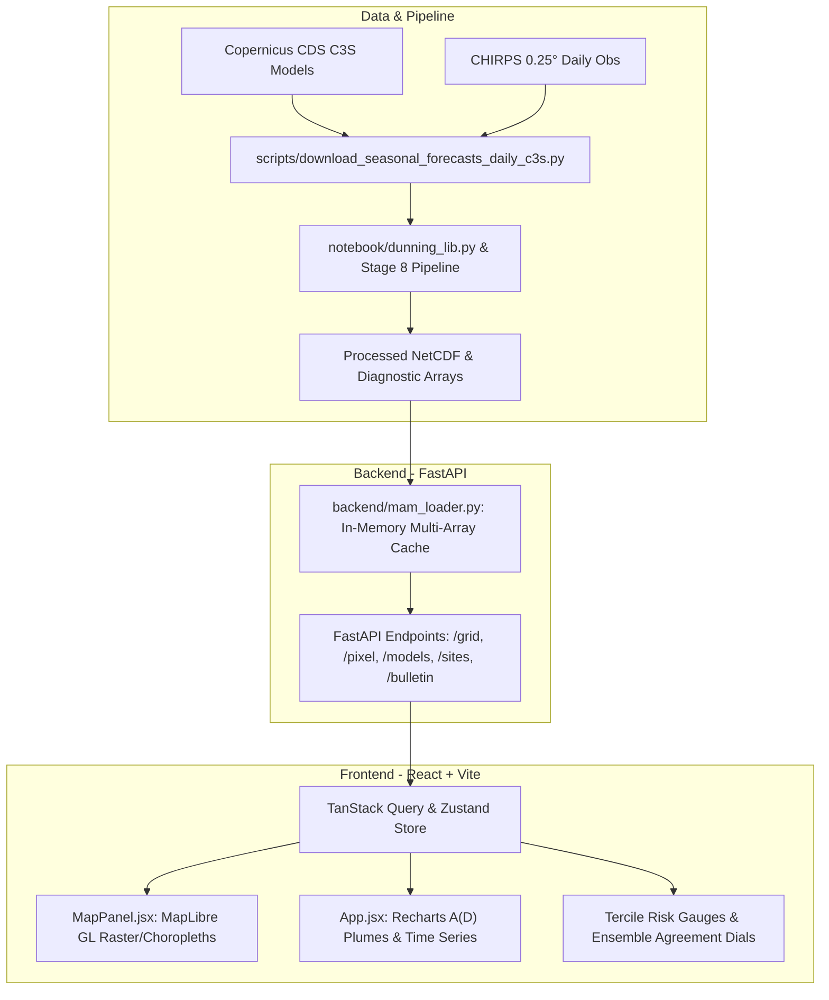

# Operational Multi-Model Seasonal Forecasting System (MAM & Kiremt)


## Probabilistic & Deterministic forecasts of Rainfall Onset (ONS), Cessation (CESS), and Season Length (SL) for Ethiopia and Kenya 

[](https://www.python.org/)
[](https://fastapi.tiangolo.com/)
[](https://reactjs.org/)
[](https://vitejs.dev/)
[](https://www.docker.com/)
[](https://opensource.org/licenses/MIT)

An operational, end-to-end seasonal climate forecasting and decision-support system designed for East Africa (**Kenya MAM "Long Rains"**, **Kenya OND "Short Rains"**, **Ethiopia "Kiremt" (June - September) and "Belg" (February - May)** seasons). 

Developed for **ILRI (International Livestock Research Institute) Climate Services** and **CGIAR**, this platform moves beyond traditional seasonal rainfall totals by delivering high-resolution probabilistic forecasts of **Rainfall Onset (ONS)**, **Cessation (CESS)**, and **Length of Growing Period (LGP / Season Length)** derived from Copernicus Climate Change Service (C3S) multi-model ensembles and calibrated against CHIRPS observations.

---

## Table of Contents

- [Scientific Methodology](#scientific-methodology)
  - [The Dunning et al. (2016) Detection Method](#the-dunning-et-al-2016-detection-method)
  - [Multi-Model Ensembles & Bias Correction](#multi-model-ensembles--bias-correction)
  - [Probabilistic Terciles & Skill Weighting](#probabilistic-terciles--skill-weighting)
- [System Architecture](#system-architecture)
- [Repository Structure](#repository-structure)
- [Data Sources](#data-sources)
- [Getting Started](#getting-started)
  - [Prerequisites](#prerequisites)
  - [Environment Configuration](#environment-configuration)
  - [Local Development](#local-development)
  - [Docker Deployment](#docker-deployment)
  - [Cloud Deployment (Render & Vercel)](#cloud-deployment-render--vercel)
- [API Documentation](#api-documentation)
- [Dashboard Features](#dashboard-features)
- [Contributors & Attribution](#contributors--attribution)
- [License](#license)

---

## Scientific Methodology

Agricultural and pastoral livelihoods in East Africa are acutely sensitive to the timing of seasonal rainfall. Early or delayed onsets, false starts, and premature cessations often lead to crop failure or pasture depletion regardless of total cumulative seasonal precipitation.

```
       Cumulative Anomalous Rainfall: A(d) = Σ [R(t) - Q_bar]
                 
        A(d) ▲
             │   Inflection point (onset)
             │      \                     Inflection point (cessation)
             │       \                                 /
             │        \___                           _▲
             │            \                         /
             │             \                       /
             │              \                     /
             │               ▼                   /
             │             Onset (d_s)      Cessation (d_e)
             └────────────────────────────────────────────────► Day of Year (DOY)
                            ◄──── LGP (Season Length) ────►
```

### The Dunning et al. (2016) Detection Method

The pipeline implements a vectorized implementation of the **Dunning et al. (2016)** cumulative anomalous rainfall algorithm (`notebook/dunning_lib.py`):

$$A(d) = \sum_{t=1}^d \left( R(t) - \bar{Q} \right)$$

where $R(t)$ is daily precipitation on day $t$, and $\bar{Q}$ is the climatological mean daily rainfall rate across the operational search window.

- **Onset ($d_s$)**: The minimum of the cumulative anomaly curve $A(d)$, marking the day rainfall consistently begins exceeding the climatological daily average.
- **Cessation ($d_e$)**: The maximum of $A(d)$ after onset, representing the cessation of meaningful moisture influx.
- **LGP**: Length of Growing Period in days ($d_e - d_s$).
- **Quality Flags**: Identifies normal seasons (`FLAG_VALID = 0`), onset failures / false starts (`FLAG_NO_ONSET = 1`), cessation failures (`FLAG_NO_CESSATION = 2`), and marginal/short seasons (`FLAG_SHORT_SEASON = 3`).

### Multi-Model Ensembles & Bias Correction

The system ingests hindcasts and operational runs across **8 Global Climate Models (GCMs)** from C3S:
1. **ECMWF SEAS5** (Europe)
2. **UK Met Office GloSea6** (UKMO)
3. **Météo-France System 8 / 9**
4. **DWD GCFS2.1 / 2.2** (Germany)
5. **CMCC-SPS4** (Italy)
6. **NCEP CFSv2** (NOAA / USA)
7. **ECCC CanSIPS** (Canada)
8. **BOM ACCESS-S2** (Australia)

All model forecast members are bias-corrected daily using empirical quantile mapping and empirical CDF matching against the **CHIRPS v2.0** climatology before computing onset and cessation dates.

### Probabilistic Terciles & Skill Weighting

- **Tercile Partitioning**: Onset, cessation, and LGP are categorized against the 1981–2016 historical climatology into:
  - **Below Normal (BN)** (Early onset / Short season)
  - **Near Normal (NN)** (Normal timing)
  - **Above Normal (AN)** (Delayed onset / Extended season)
- **Probability Shrinkage ($\alpha$)**: Dampens raw ensemble frequencies toward climatology ($1/3, 1/3, 1/3$) in regions where model hindcast skill is low to prevent overconfident warnings.
- **Ensemble Aggregation Modes** (`skill_weighted_ensemble.py`):
  - **Equal Weighting**: Unweighted multi-model mean.
  - **Hit Rate (HR) Weighted**: Weights proportional to historical categorical hit rate.
  - **RPSS (Ranked Probability Skill Score) Weighted**: Weights based on cross-validated probabilistic skill against climatology.

---

## System Architecture



---

## Repository Structure

```
├── backend/                        # FastAPI REST API
│   ├── main.py                     # API entry point & CORS configuration
│   ├── mam_loader.py               # Multidimensional data loader & layer engine
│   ├── requirements.txt            # Python dependencies
│   ├── skill_weighted_ensemble.py  # Stage 8 skill-weighting integration
│   └── kenya_api/                  # Modular route handlers
│       ├── grid.py                 # GET /grid (GeoJSON raster layers)
│       ├── pixel.py                # GET /pixel, /chirps, /taylor, /validation
│       ├── models.py               # GET /models
│       ├── sites.py                # GET /sites
│       └── bulletin.py             # GET /bulletin (Automated PDF/PNG advisories)
│
├── frontend/                       # Modern React 18 + Vite SPA
│   ├── package.json
│   ├── vite.config.js              # Chunk splitting & proxy configuration
│   ├── tailwind.config.js          # Styling tokens
│   ├── public/
│   │   └── boundaries/             # Kenya & Ethiopia administrative boundaries
│   └── src/
│       ├── App.jsx                 # Dashboard views, charts, and gauge panels
│       ├── main.jsx                # React root
│       ├── index.css               # Design system tokens (light/dark mode)
│       ├── api/queries.js          # TanStack Query server state hooks
│       ├── store/useDashboardStore.js # Zustand state store
│       └── components/
│           ├── MapPanel.jsx        # MapLibre GL interactive mapping component
│           └── LandingPage.jsx     # Landing overview & country selector
│
├── docker/                         # Production & Cloud deployment
│   ├── Dockerfile.backend          # Python 3.11 backend container
│   ├── Dockerfile.frontend         # Nginx multi-stage build for frontend
│   ├── Dockerfile.huggingface      # Single-container image for HF Spaces
│   ├── docker-compose.yml          # Local multi-service orchestration
│   ├── nginx.conf                  # Reverse proxy & SPA routing config
│   ├── DEPLOYMENT_GUIDE.md         # Deployment instructions (Docker/HF/Vercel)
│   └── test_deployment.py         # Automated deployment verification script
│
├── data/
│   └── shapefiles/                 # Administrative boundaries (Kenya & Ethiopia)
│
├── notebook/                       # Research, validation, and calibration notebooks
│   ├── dunning_lib.py              # Core vectorized Dunning algorithm library
│   ├── notebook_multimodel_stage8.ipynb # Multi-model aggregation pipeline
│   └── onset-cessation-lgp_*.ipynb # Model-specific calibration notebooks
│
├── scripts/                        # Automation & Data Ingestion
│   ├── download_chirps.py          # CHIRPS daily download & clip script
│   ├── download_seasonal_forecasts_daily_c3s.py # C3S CDS download pipeline
│   └── inspect_netcdf.py           # NetCDF metadata & variable inspector
│
├── bulletin_multimodel_v1.py       # Publication-ready bulletin generator
├── skill_weighted_ensemble.py      # Standalone ensemble weighting script
├── setup.py                        # Automated project setup script
└── vercel.json                     # Vercel SPA routing & API proxy rules
```

---

## Data Sources

1. **Observational Baseline**:
   - **CHIRPS v2.0** (Climate Hazards Group InfraRed Precipitation with Station data).
   - Spatial resolution: **0.25°** (~27 km grid).
   - Historical period: **1981–present**.
2. **Seasonal Climate Model Hindcasts & Operational Forecasts**:
   - Copernicus Climate Change Service (C3S) Data Store (CDS).
   - Daily precipitation fields with 20 to 51 ensemble members per model.
3. **Administrative Boundaries**:
   - Kenya (Admin Levels 0, 1, 2) & Ethiopia (Admin Levels 0, 1, 2, 3) from UN OCHA / Humanitarian Data Exchange (HDX).

---

## Getting Started

### Prerequisites

- **Python 3.10+** (Python 3.11 recommended)
- **Node.js 18+** and **npm**
- **Docker & Docker Compose** (optional, for containerized execution)

### Environment Configuration

1. **Root Environment (`.env`)**:
   ```bash
   cp .env.example .env
   ```
   Configure your pipeline output directory and operational forecast year:
   ```ini
   DATA_DIR=D:/dashboard_ons_cess_sl/data
   OP_YEAR=2026
   LOAD_BC_DAILY=1
   ```

2. **Frontend Environment (`frontend/.env`)**:
   ```bash
   cp frontend_env_example.txt frontend/.env
   ```
   *(Note: The map interface is powered by MapLibre GL with open CARTO basemaps. A Mapbox token is optional).*

---

### Local Development

#### 1. Automated Setup
You can run the one-shot setup script to configure folders, dependencies, and verify code integrity:
```bash
python setup.py
```

#### 2. Start Backend API
```bash
cd backend
pip install -r requirements.txt
uvicorn main:app --reload --port 8765
```
- API interactive docs: `http://localhost:8765/docs`
- Health endpoint: `http://localhost:8765/health`

#### 3. Start Frontend UI
In a separate terminal:
```bash
cd frontend
npm install
npm run dev
```
Open your browser at `http://localhost:5173`.

---

### Docker Deployment

To launch the full stack (FastAPI backend + Nginx frontend) via Docker Compose:

```bash
docker compose -f docker/docker-compose.yml --env-file .env up -d --build
```

Test the container deployment:
```bash
python docker/test_deployment.py
```

---

### Cloud Deployment (Render & Vercel)

The system is architected for decoupled cloud deployment: **FastAPI backend on Render** and **React frontend on Vercel**.

#### 1. Backend Deployment on Render (Web Service)
1. Sign in to [Render](https://render.com) and click **"New +"** $\rightarrow$ **"Web Service"**.
2. Select **"Build and deploy from a Git repository"** and choose `YonSci/-Operational-Multi-Model-Seasonal-Forecasting-System`.
3. Configure the service settings:
   - **Root Directory**: `backend`
   - **Runtime**: `Python 3`
   - **Build Command**: `pip install -r requirements.txt`
   - **Start Command**: `uvicorn main:app --host 0.0.0.0 --port $PORT`
   - **Instance Type**: `Free`
4. Add Environment Variables:
   - `PYTHON_VERSION`: `3.11.9`
   - `OP_YEAR`: `2026`
   - `LOAD_BC_DAILY`: `0` *(Crucial on Render free tier (512MB RAM): prevents loading 4GB of daily precipitation arrays into RAM to eliminate Out-of-Memory crashes).*
5. Click **"Create Web Service"**. Once deployed, copy your backend URL (e.g. `https://seasonal-forecast-backend.onrender.com`).

#### 2. Frontend Deployment on Vercel
1. Sign in to [Vercel](https://vercel.com) and click **"Add New..."** $\rightarrow$ **"Project"**.
2. Import `YonSci/-Operational-Multi-Model-Seasonal-Forecasting-System`.
3. Build Settings:
   - The repository includes root-level redirection scripts and `vercel.json` so you can leave the **Root Directory** as default `./` or set it to **`frontend`**.
   - **Build Command**: `npm run build`
   - **Output Directory**: `dist` (or `frontend/dist`)
4. Add Environment Variables:
   - `VITE_API_BASE`: `https://<your-backend-name>.onrender.com` *(paste your live Render backend URL from step 1, without a trailing slash)*
5. Click **"Deploy"**. Vercel will build the frontend and provide your production URL (e.g. `https://<project-name>.vercel.app`).

---

## API Documentation

The FastAPI backend exposes the following primary endpoints:

| Endpoint | Method | Description |
| :--- | :---: | :--- |
| `/health` | `GET` | System status, loaded models count, and CHIRPS mean statistics. |
| `/models` | `GET` | List active C3S models, member counts, and operational years. |
| `/grid` | `GET` | GeoJSON FeatureCollection of spatial grid values for any variable and layer. |
| `/pixel` | `GET` | Point-level statistics, member plumes, cumulative anomalies, and terciles for a coordinate (`lat`, `lon`). |
| `/sites` | `GET` | Pre-configured monitored agricultural & pastoral locations. |
| `/chirps_historical`| `GET` | CHIRPS historical onset/cessation/LGP time-series and trend slope. |
| `/validation` | `GET` | Domain-mean hindcast validation metrics (RPSS, Hit Rate) per year. |
| `/bulletin` | `GET` | Generates a high-resolution seasonal forecast bulletin for a given site. |

### Valid Spatial Grid Layers (16 Layers)
`anomaly`, `spread`, `median`, `prob_bn`, `prob_nn`, `prob_an`, `failure`, `chirps_p50`, `chirps_spread`, `bias`, `detection_rate`, `rpss_val`, `hitrate_val`, `alpha`, `hr_weighted`, `rpss_weighted`.

---

## Dashboard Features

1. **Forecast Overview**:
   - Spatial choropleths of expected onset DOY, cessation DOY, and season length anomalies.
   - Interactive pixel inspector showing ensemble plume spread (P10, P50, P90).
2. **Probabilistic Outlook**:
   - Spatial tercile probabilities (Below, Near, Above Normal) with false onset risk flags.
   - Risk dials showing categorical distribution for any clicked coordinate.
3. **Multi-Model Comparison**:
   - Compare Equal, Hit-Rate Weighted, and RPSS-Weighted ensemble projections side-by-side.
   - Plume overlays showing individual model contributions and consensus.
4. **Model Skill & Validation**:
   - Historical Ranked Probability Skill Scores (RPSS) and Hit Rates against CHIRPS.
   - Taylor diagrams indicating standard deviation ratios and correlation coefficients.
5. **Field Bulletins**:
   - One-click export of publication-quality seasonal advisories tailored for agricultural extension officers and livestock managers.

---

## Contributors & Attribution

- **Project Lead:** Dr. Teferi Demissie · [t.demissie@cgiar.org](mailto:t.demissie@cgiar.org)
- **Principal Developer & Data Scientist:** Yonas Mersha · [y.mersha@cgiar.org](mailto:y.mersha@cgiar.org)
- **Affiliation:** [ILRI Climate Services](https://www.ilri.org/) · [CGIAR Research Program](https://www.cgiar.org/)

If you utilize this software or methodology in research or operational climate services, please cite:
> Dunning, C. M., Black, E. C. L., & Allan, R. P. (2016). *The onset and cessation of seasonal rainfall over Africa*. Journal of Geophysical Research: Atmospheres, 121(19), 11-405. https://doi.org/10.1002/2016JD025428

---

## License

This project is licensed under the **MIT License** - see the [LICENSE](LICENSE) file for details.
