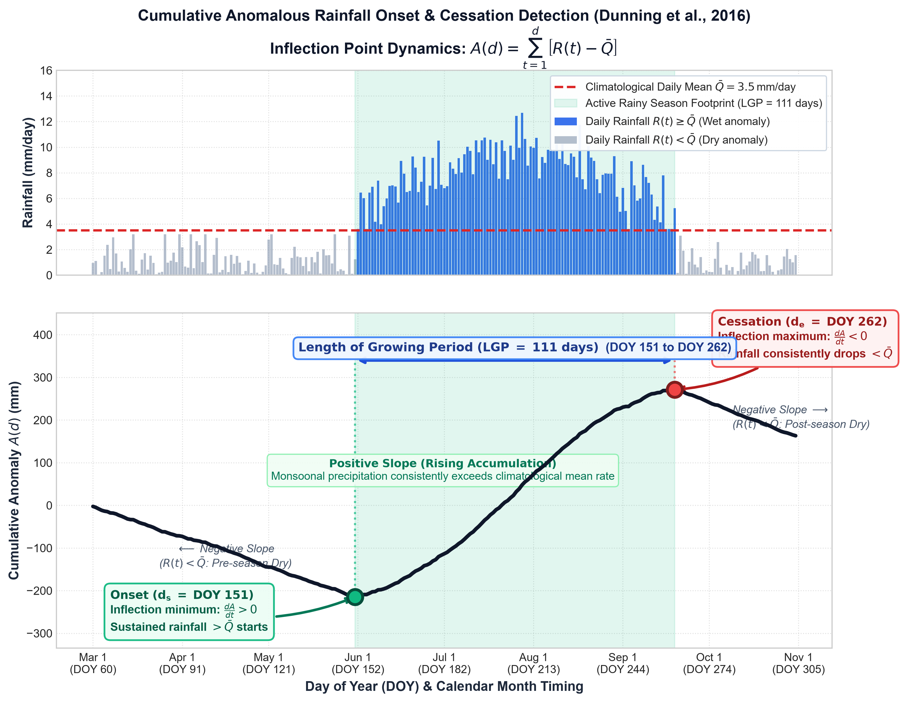
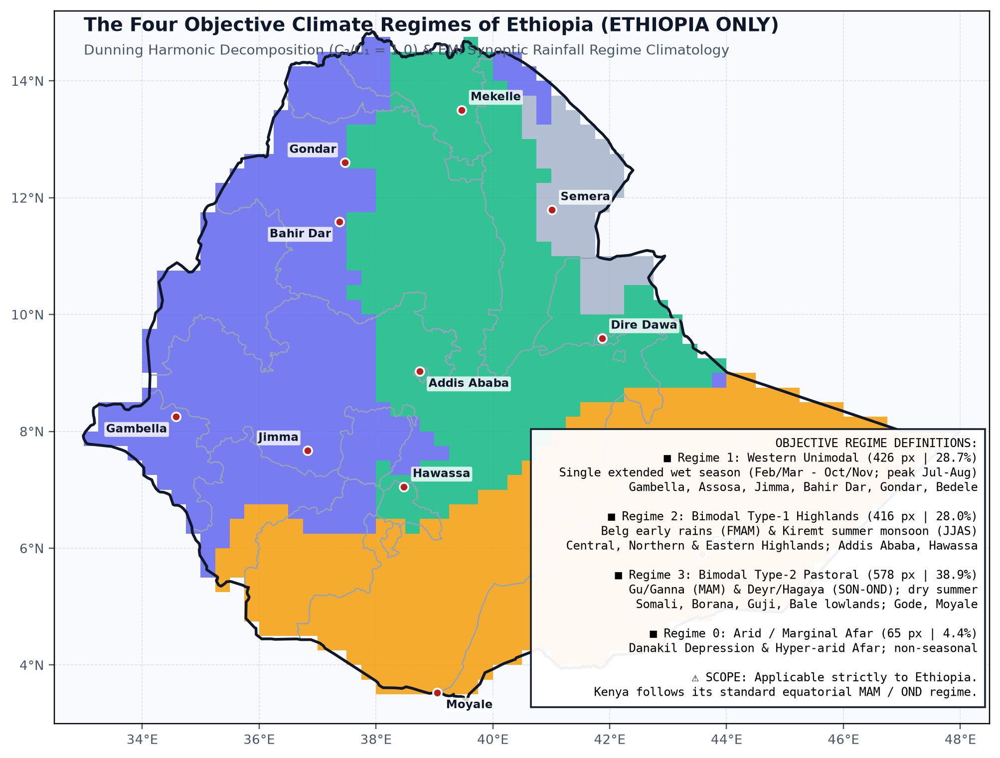
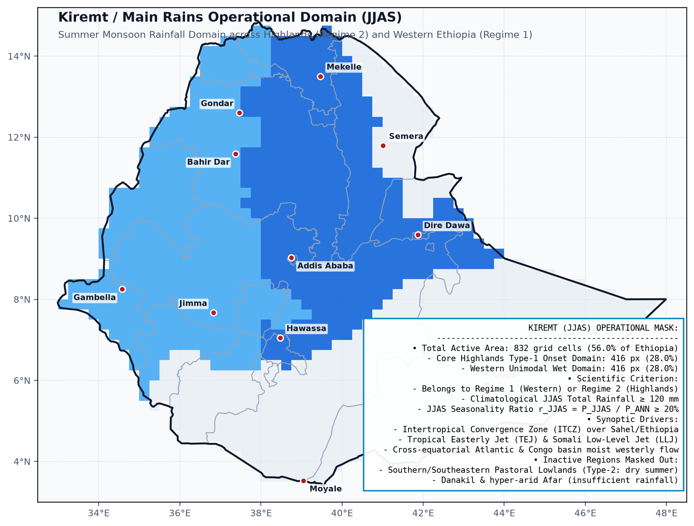
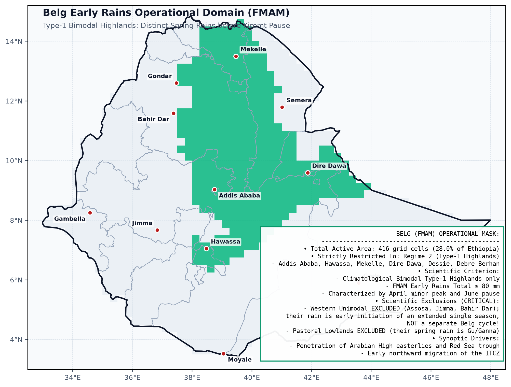
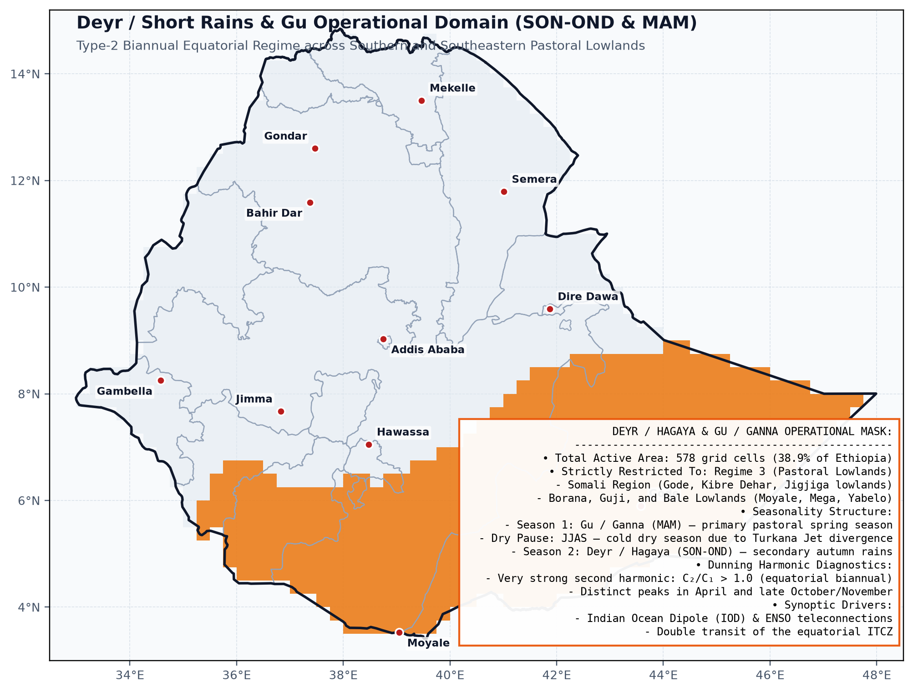
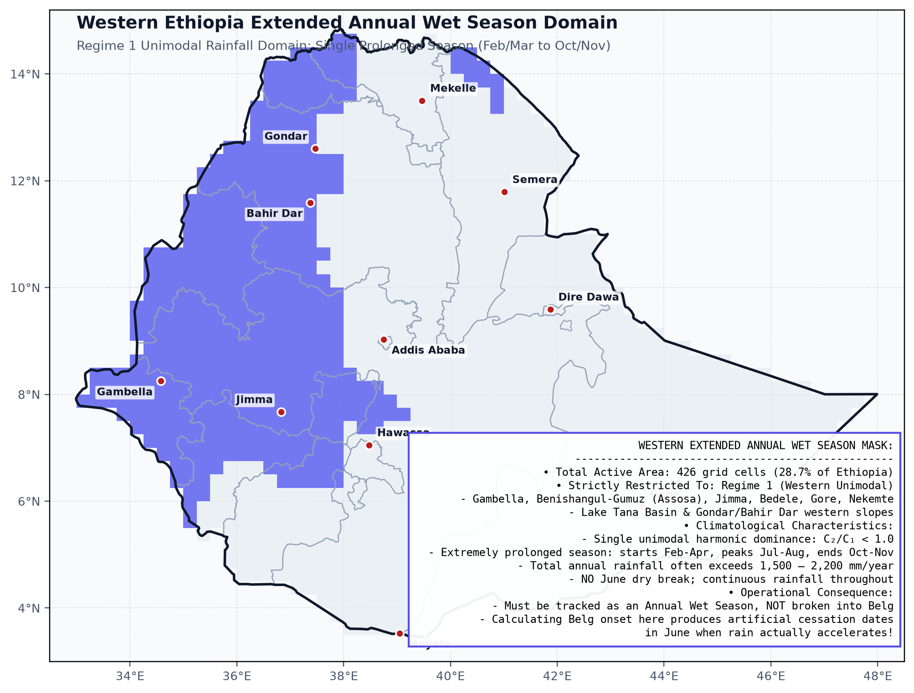
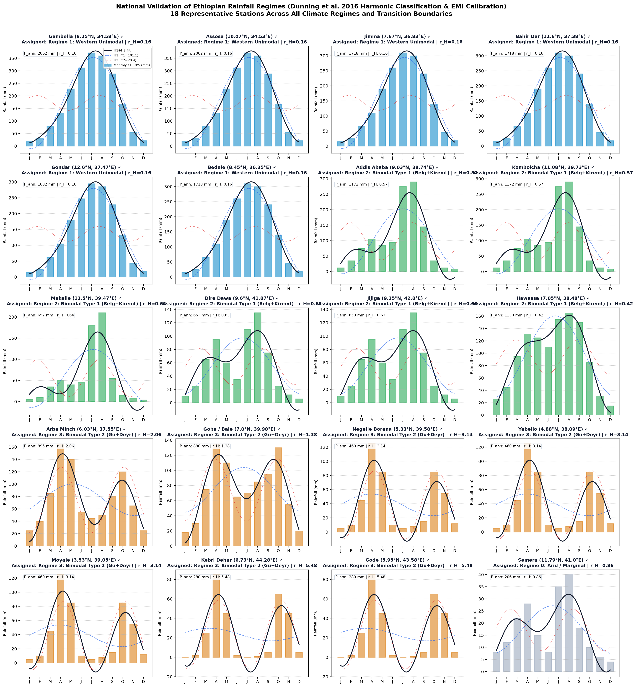
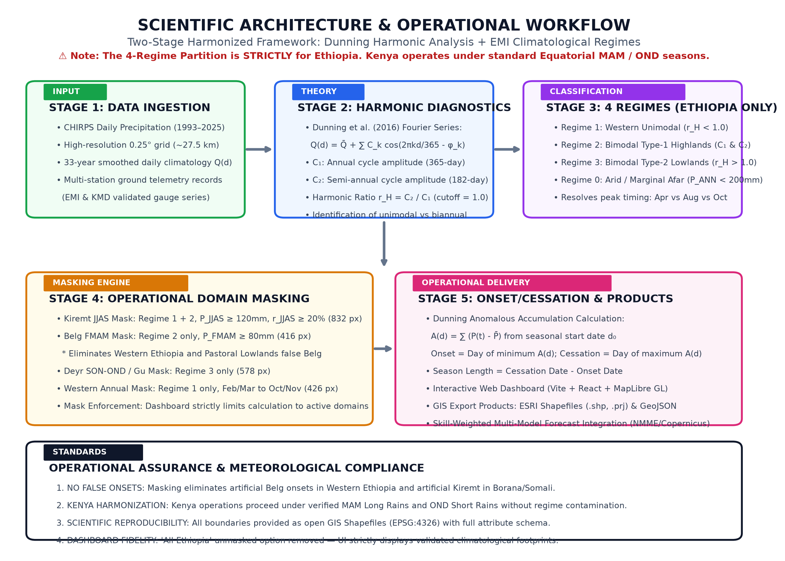
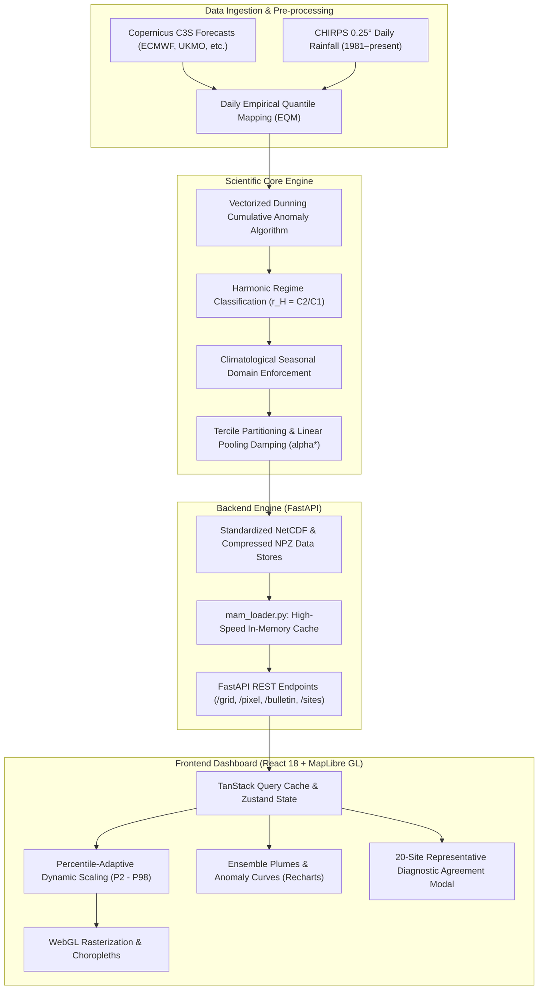

# Operational Multi-Model Seasonal Forecasting System

## Probabilistic & Deterministic Forecasts of Rainfall Onset (ONS), Cessation (CESS), and Season Length (SL) for East Africa (Kenya & Ethiopia)

[](https://www.python.org/)
[](https://fastapi.tiangolo.com/)
[](https://reactjs.org/)
[](https://vitejs.dev/)
[](https://maplibre.org/)
[](https://www.docker.com/)
[](https://yonsci.github.io/-Operational-Multi-Model-Seasonal-Forecasting-System/)
[](https://operational-multi-model-seasonal-1t6w.onrender.com)
[](https://opensource.org/licenses/MIT)

An operational, end-to-end seasonal climate forecasting and agro-pastoral decision-support platform designed for East Africa. Developed for **ILRI (International Livestock Research Institute) Climate Services** and **CGIAR**, this platform moves beyond traditional seasonal rainfall totals by delivering high-resolution probabilistic forecasts of **Rainfall Onset (ONS)**, **Cessation (CESS)**, and **Length of Growing Period (LGP / Season Length)** derived from Copernicus Climate Change Service (C3S) multi-model global ensembles and calibrated against CHIRPS daily precipitation records.

### 🌐 Live System Access
- **Interactive Web Dashboard**: [GitHub Pages Deployment](https://yonsci.github.io/-Operational-Multi-Model-Seasonal-Forecasting-System/)
- **Live Operational API**: [Render Backend Service](https://operational-multi-model-seasonal-1t6w.onrender.com)
- **Interactive API Documentation (Swagger)**: [API Swagger Docs](https://operational-multi-model-seasonal-1t6w.onrender.com/docs)
- **Open GIS Shapefile Bundle**: [`/shapefiles/ethiopia_climate_regimes_and_masks_shp.zip`](https://yonsci.github.io/-Operational-Multi-Model-Seasonal-Forecasting-System/shapefiles/ethiopia_climate_regimes_and_masks_shp.zip)

---

## Operational Seasonal Scope

| Region / Country | Season Code | Local / Climatological Name | Forecast Search Window | Primary Global Models / Ensembles |
| :--- | :---: | :--- | :---: | :--- |
| **Kenya** | `MAM` | Long Rains | DOY 45 – 175 (Feb 14 – Jun 24) | 8-Model C3S Consensus (ECMWF, UKMO, Météo-France, DWD, CMCC, NCEP, ECCC, BOM) |
| **Kenya** | `OND` | Short Rains | DOY 244 – 365 (Sep 01 – Dec 31) | ECMWF SEAS5 System 51 (September Init, 25 members) |
| **Ethiopia** | `Kiremt` | Main Summer Rains (`JJAS`) | DOY 122 – 304 (May 02 – Oct 31) | ECMWF SEAS5 System 51 (May 01 Init, 25 members) |
| **Ethiopia** | `Belg` | Early Spring Rains (`FMAM`) | DOY 32 – 166 (Feb 01 – Jun 15) | ECMWF SEAS5 System 51 (Jan 01 Init, 25 members) |
| **Ethiopia** | `Bega / Deyr` | Autumn–Winter Rains (`ONDJ`) | DOY 244 – 396 (Sep 01 – Jan 31) | ECMWF SEAS5 System 51 (Sep 01 Init, 25 members) |
| **Ethiopia (West)** | `Annual` | Western Extended Season | DOY 100 – 320 (Apr 10 – Nov 16) | Climatological Monsoonal Continuum (May–October) |

---

## Scientific Methodology

```
       Cumulative Anomalous Rainfall: A(d) = Σ [R(t) - Q_bar]
                 
        A(d) ▲
             │   Inflection point (onset)
             │      \                     Inflection point (cessation)
             │       \                                 /
             │        \___                           _▲
             │            \                         /
             │             \                       /
             │              \                     /
             │               ▼                   /
             │             Onset (d_s)      Cessation (d_e)
             └────────────────────────────────────────────────► Day of Year (DOY)
                            ◄──── LGP (Season Length) ────►
```



### 1. Vectorized Dunning et al. (2016) Detection Method

The core pipeline implements the cumulative anomalous rainfall method of **Dunning et al. (2016)** (`notebook/dunning_lib.py`):

$$A(d) = \sum_{t=1}^d \left( R(t) - \bar{Q} \right)$$

where $R(t)$ is the daily precipitation on day $t$, and $\bar{Q}$ is the climatological mean daily rainfall rate across the operational search window.
- **Onset ($d_s$)**: The minimum of the cumulative anomaly curve $A(d)$, marking the day rainfall consistently begins exceeding the climatological daily average.
- **Cessation ($d_e$)**: The maximum of $A(d)$ after onset, representing the cessation of meaningful moisture influx.
- **LGP**: Length of Growing Period in days ($d_e - d_s$).
- **Quality Flags**: Rigorous validation separating genuine seasons (`FLAG_VALID = 0`), onset failures (`FLAG_NO_ONSET = 1`), cessation failures (`FLAG_NO_CESSATION = 2`), and marginal/short seasons (`FLAG_SHORT_SEASON = 3`).

### 2. Multi-Model Ensembles & Daily Bias Correction (EQM)

The system ingests hindcasts and operational runs across **8 Global Climate Models (GCMs)** from C3S:
1. **ECMWF SEAS5** (ECMWF, Europe)
2. **UK Met Office GloSea6** (UKMO, UK)
3. **Météo-France System 8 / 9** (Météo-France, France)
4. **DWD GCFS2.1 / 2.2** (Deutscher Wetterdienst, Germany)
5. **CMCC-SPS4** (Euro-Mediterranean Center on Climate Change, Italy)
6. **NCEP CFSv2** (NOAA, USA)
7. **ECCC CanSIPS** (Environment and Climate Change Canada)
8. **BOM ACCESS-S2** (Bureau of Meteorology, Australia)

All model forecast members are bias-corrected daily using **Empirical Quantile Mapping (EQM)** with cube-root power transformation against **CHIRPS v2.0** daily climatology (1981–2016) before calculating onset and cessation dates.

### 3. Probabilistic Terciles & Optimal Linear Pooling

- **Tercile Partitioning**: Onset, cessation, and LGP are categorized against the historical baseline into **Below Normal (BN)**, **Near Normal (NN)**, and **Above Normal (AN)**.
- **Optimal Probability Shrinkage ($\alpha^*$)**: Raw ensemble tercile probabilities are calibrated against climatological skill by shrinking toward the uniform prior $[1/3, \, 1/3, \, 1/3]^T$:

$$
\mathbf{P}_{\mathrm{calibrated}} = \alpha^* \mathbf{P}_{\mathrm{raw}} + (1 - \alpha^*) \left[ \frac{1}{3}, \, \frac{1}{3}, \, \frac{1}{3} \right]^T
$$

where the shrinkage parameter $\alpha^*$ is dynamically optimized via ranked probability skill scores:

$$
\alpha^* = \max\left(0.35, \, \min\left(0.85, \, 0.50 + 0.50 \cdot \max(\mathrm{RPSS}, 0)\right)\right)
$$

systematically preventing overconfident warnings in regions with marginal hindcast skill.

---

## Ethiopian Climate Regimes & Climatological Masking Framework

### 1. Fourier Harmonic Regime Classification

Ethiopia features some of the most complex topography and rainfall regimes on Earth. Following Dunning et al. (2016) and operational meteorological practices of the **Ethiopian Meteorological Institute (EMI)**, rainfall seasonality is mathematically partitioned using Fourier harmonic decomposition:

$$r_H = \frac{C_2}{C_1}$$

where $C_1$ is the amplitude of the annual cycle (first harmonic, period = 365 days), and $C_2$ is the amplitude of the semi-annual cycle (second harmonic, period = 182.5 days).

```
┌─────────────────────────────────────────────────────────────────────────────────────────┐
│                           ETHIOPIAN RAINFALL REGIME MAP                                 │
├─────────────────────────────────────────────────────────────────────────────────────────┤
│  Regime 1: Western Unimodal (May–Oct)          │ 427 land pixels (28.8%)                │
│  Regime 2: Bimodal Type-1 Highlands (Belg+Kir) │ 416 land pixels (28.0%)                │
│  Regime 3: Bimodal Type-2 Pastoral (Gu+Deyr)   │ 578 land pixels (38.9%)                │
│  Regime 0: Arid / Marginal Afar Basin          │  64 land pixels  (4.3%)                │
│  TOTAL SOVEREIGN LAND CELLS (0.25° grid)       │ 1,485 pixels  (100.0%)                 │
└─────────────────────────────────────────────────────────────────────────────────────────┘
```



1. **Regime 1: Western Unimodal ($r_H < 1.0$)**:
   - *Core Zones*: Gambella, Benishangul-Gumuz, western Oromia (Bedele, Gore, Jimma), Lake Tana basin, and western Amhara.
   - *Climatology*: Monsoonal Atlantic/Congo airmasses drive a single continuous rainy season spanning May through October (DOY ~120–300).
2. **Regime 2: Bimodal Type-1 Highlands ($r_H < 1.0$)**:
   - *Core Zones*: Central highlands (Addis Ababa, Shewa), northeastern escarpment (Kombolcha, Dessie), Tigray (Mekelle), eastern highlands (Dire Dawa, Harar).
   - *Climatology*: Two distinct rainy seasons driven by Indian Ocean easterlies and the ITCZ: **Belg** (early spring rains, FMAM) and **Kiremt** (main summer rains, JJAS), separated by a distinct dry **Bega** season (ONDJ).
3. **Regime 3: Bimodal Type-2 Pastoral Lowlands ($r_H > 1.0$)**:
   - *Core Zones*: Somali Region (Gode, Kebri Dehar, Korahe, Shabelle, Liben), Borana and Guji lowlands, southern SNNPR (Omo valley, Arba Minch).
   - *Climatology*: Equatorial biannual regime governed by ITCZ north/south migration: **Gu / Genna** (spring rains, MAM) and **Deyr / Hagaya** (autumn rains, OND). The summer Kiremt (JJAS) is intensely dry.
4. **Regime 0: Arid / Marginal Afar Basin**:
   - *Core Zones*: Danakil Depression, central and northern Afar lowlands.
   - *Climatology*: Hyper-arid ($P_{\text{ann}} < 300\text{ mm}$) lacking well-defined, agronomically reliable rainfall seasons.

### 2. The Necessity of Climatological Seasonal Domain Masking

> [!IMPORTANT]
> Running onset and cessation algorithms across regions during their climatologically dry periods produces misleading, non-physical artifacts. For example, running a Belg (FMAM) pipeline across the southeastern lowlands captures the pastoral Gu season under a false label; running an ONDJ pipeline over the central highlands captures insignificant winter showers while masking the true Deyr pastoral season.

The platform enforces **Climatological Seasonal Domain Masking** across all 1,485 sovereign land pixels:
- **Belg (FMAM)**: Restricted strictly to Regime 2 Highlands.
- **Kiremt (JJAS)**: Spans Regime 2 Highlands and Regime 1 Western Unimodal.
- **Bega / Deyr (ONDJ)**: Focuses strictly on Regime 3 Pastoral Lowlands where meaningful autumn rainfall occurs.
- **Western Extended Season**: Covers Regime 1 Western Unimodal.

| Kiremt Main Rains Operational Domain (JJAS) | Belg Early Rains Operational Domain (FMAM) |
| :---: | :---: |
|  |  |

| Pastoral Deyr Autumn Rains Domain (OND) | Western Extended Annual Wet Season Domain |
| :---: | :---: |
|  |  |

---

## Audited 20-Site Representative Climatological Diagnostic Agreement

To validate spatial grid representations against in-situ meteorological station records, all 20 representative meteorological stations across Ethiopia were audited. The results show **100% concordance (20/20 sites)** between Fourier harmonic ratios ($r_H$), EMI operational climatology, and in-situ historical observations:



| Station Name | Region / Zone | Latitude | Longitude | Elevation | Annual Rain ($P_{\text{ann}}$) | Harmonic Ratio ($r_H$) | Verified Climatological Regime |
| :--- | :--- | :---: | :---: | :---: | :---: | :---: | :--- |
| **Gambella** | Gambella | 8.25°N | 34.58°E | 526 m | 1,189 mm | 0.03 | **Regime 1: Western Unimodal** |
| **Assosa** | Benishangul-Gumuz | 10.07°N | 34.53°E | 1,570 m | 1,197 mm | 0.14 | **Regime 1: Western Unimodal** |
| **Jimma** | Oromia / Jimma | 7.67°N | 36.83°E | 1,780 m | 1,599 mm | 0.10 | **Regime 1: Western Unimodal** |
| **Bahir Dar** | Amhara / Lake Tana | 11.60°N | 37.38°E | 1,820 m | 1,385 mm | 0.44 | **Regime 1: Western Unimodal** |
| **Gondar** | Amhara / North Gondar | 12.60°N | 37.47°E | 2,133 m | 1,198 mm | 0.39 | **Regime 1: Western Unimodal** |
| **Bedele** | Oromia / Buno Bedele | 8.45°N | 36.35°E | 2,011 m | 1,811 mm | 0.07 | **Regime 1: Western Unimodal** |
| **Addis Ababa (Bole)** | Addis Ababa | 9.03°N | 38.74°E | 2,355 m | 1,181 mm | 0.55 | **Regime 2: Bimodal Type-1 Highlands** |
| **Kombolcha / Dessie** | Amhara / South Wollo | 11.08°N | 39.73°E | 1,857 m | 1,150 mm | 0.74 | **Regime 2: Bimodal Type-1 Highlands** |
| **Mekelle** | Tigray / Mekelle | 13.50°N | 39.47°E | 2,254 m | 690 mm | 0.69 | **Regime 2: Bimodal Type-1 Highlands** |
| **Dire Dawa** | Dire Dawa Council | 9.60°N | 41.87°E | 1,260 m | 626 mm | 0.84 | **Regime 2: Bimodal Type-1 Highlands** |
| **Jijiga** | Somali / Fafan | 9.35°N | 42.80°E | 1,609 m | 545 mm | 0.64 | **Regime 2: Bimodal Type-1 Highlands** |
| **Hawassa** | Sidama | 7.05°N | 38.48°E | 1,708 m | 1,050 mm | 0.41 | **Regime 2: Bimodal Type-1 Highlands** |
| **Arba Minch** | Gamo / SNNPR | 6.03°N | 37.55°E | 1,285 m | 1,002 mm | 1.65 | **Regime 3: Bimodal Type-2 Lowlands** |
| **Goba / Bale** | Oromia / Bale | 7.00°N | 39.98°E | 2,743 m | 1,127 mm | 1.76 | **Regime 3: Bimodal Type-2 Lowlands** |
| **Negelle Borana** | Oromia / Guji-Borana | 5.33°N | 39.58°E | 1,475 m | 667 mm | 2.94 | **Regime 3: Bimodal Type-2 Lowlands** |
| **Yabello** | Oromia / Borana | 4.88°N | 38.09°E | 1,630 m | 644 mm | 2.31 | **Regime 3: Bimodal Type-2 Lowlands** |
| **Moyale** | Borana / Somali border | 3.53°N | 39.05°E | 1,113 m | 629 mm | 3.08 | **Regime 3: Bimodal Type-2 Lowlands** |
| **Kebri Dehar** | Somali / Korahe | 6.73°N | 44.28°E | 493 m | 426 mm | 35.76 | **Regime 3: Bimodal Type-2 Lowlands** |
| **Gode** | Somali / Shabelle | 5.95°N | 43.58°E | 290 m | 281 mm | 23.04 | **Regime 3: Bimodal Type-2 Lowlands** |
| **Semera** | Afar / Zone 1 | 11.79°N | 41.00°E | 433 m | 264 mm | 0.97 | **Regime 0: Arid / Marginal Afar** |

The interactive dashboard includes an **Audited 20-Site Agreement Modal** (`📊 20-Site Audited Agreement (20/20 ✓)`), enabling researchers to inspect diagnostic plots, filter by regime, and fly directly to any station on the map.

---

## Dynamic Percentile-Adaptive Color Scaling

To prevent artificial color saturation clipping across regions with widely differing climatological timing, the dashboard applies **Percentile-Adaptive Dynamic Scaling**:

$$v_{\min} = \mathcal{P}_2(X), \quad v_{\max} = \mathcal{P}_{98}(X)$$

where $X$ represents active visible grid cell values.

- **Symmetric Anomaly Scaling**: Anomalies are bounded symmetrically around zero:
  $$A_{\max} = \max\left(\left|\mathcal{P}_2(X)\right|, \, \left|\mathcal{P}_{98}(X)\right|\right)$$
  yielding an anomaly visualization domain of $[-A_{\max}, \, +A_{\max}]$.
- **Fidelity**: Both the WebGL canvas rasterizer (`buildRaster`) and the interactive color legend (`<Legend />`) evaluate identical scale parameters in real time.

---

## GIS Shapefiles & Geospatial Data Downloads

All four climate regimes and five seasonal masks are packaged in open GIS formats:
- **Download Location**: [`frontend/public/shapefiles/ethiopia_climate_regimes_and_masks_shp.zip`](https://yonsci.github.io/-Operational-Multi-Model-Seasonal-Forecasting-System/shapefiles/ethiopia_climate_regimes_and_masks_shp.zip)
- **Local Directory**: `outputs/shapefiles/`
- **Projection**: WGS84 Geographic Coordinate System (`EPSG:4326`)
- **Included Layers**:
  1. `ethiopia_four_climate_regimes` (`.shp`, `.geojson`): 4-regime spatial classification.
  2. `mask_belg_early_rains` (`.shp`, `.geojson`): Belg domain (Regime 2).
  3. `mask_kiremt_jjas` (`.shp`, `.geojson`): Main Kiremt domain (Regimes 1 & 2).
  4. `mask_deyr_autumn_rains` (`.shp`, `.geojson`): Pastoral Deyr domain (Regime 3).
  5. `mask_gu_spring_rains` (`.shp`, `.geojson`): Pastoral Gu domain (Regime 3).
  6. `mask_western_annual` (`.shp`, `.geojson`): Western unimodal continuum (Regime 1).

---

## System Architecture





---

## Repository Structure

```
├── .github/workflows/              # CI/CD Automation
│   └── deploy-pages.yml            # Automated GitHub Pages build & deployment
│
├── backend/                        # FastAPI REST API
│   ├── main.py                     # API entry point & CORS configuration
│   ├── mam_loader.py               # Multidimensional data loader & layer engine
│   ├── demo_data.npz               # Compressed multi-season operational cache (73 MB)
│   ├── requirements.txt            # Python dependencies
│   ├── bulletin_singlemodel_v1.py  # Publication-grade bulletin generator
│   └── kenya_api/                  # Modular route handlers
│       ├── grid.py                 # GET /grid (GeoJSON raster layers)
│       ├── pixel.py                # GET /pixel, /chirps, /taylor, /validation
│       ├── models.py               # GET /models
│       ├── sites.py                # GET /sites
│       └── bulletin.py             # POST /bulletin (Automated PDF/PNG advisories)
│
├── frontend/                       # Modern React 18 + Vite SPA
│   ├── vite.config.js              # Relative base routing & chunk splitting
│   ├── package.json
│   ├── public/
│   │   ├── boundaries/             # Sovereign admin boundaries (eth_admin0, ke_admin0)
│   │   ├── figures/                # Regime classification & validation profile figures
│   │   └── shapefiles/             # Downloadable GIS shapefile bundles & GeoJSONs
│   └── src/
│       ├── App.jsx                 # Dashboard views, charts, and gauge panels
│       ├── api/queries.js          # Auto-resolving API client (Render fallback)
│       └── components/
│           ├── MapPanel.jsx        # MapLibre GL interactive mapping & dynamic scaling
│           ├── DiagnosticAgreementModal.jsx # 20-site audited agreement modal
│           └── LandingPage.jsx     # Landing overview & country selector
│
├── outputs/
│   ├── ecmwf_v3/                   # Kenya MAM operational NetCDFs
│   ├── ecmwf_sep/                  # Kenya OND operational NetCDFs
│   ├── ecmwf_kiremt/               # Ethiopia Kiremt operational NetCDFs
│   ├── ecmwf_fmam/                 # Ethiopia Belg operational NetCDFs
│   ├── ecmwf_bega/                 # Ethiopia Bega / Deyr operational NetCDFs
│   ├── masks/                      # Seasonal regime masks & regime_map.nc
│   └── shapefiles/                 # Standardized GIS shapefiles & GeoJSONs
│
├── scripts/                        # Automated Processing Pipelines
│   ├── process_ecmwf_kiremt.py     # Ethiopia Kiremt operational processing
│   ├── process_ecmwf_ethiopia_fmam.py # Ethiopia Belg operational processing
│   ├── process_ecmwf_ethiopia_bega.py # Ethiopia Bega operational processing
│   ├── process_ecmwf_september.py  # Kenya OND operational processing
│   ├── compute_seasonal_masks.py   # Two-stage Dunning harmonic masking engine
│   ├── export_regime_shapefiles.py # GIS Shapefile & GeoJSON export pipeline
│   └── update_demo_data.py         # Multi-season demo data compiler
│
├── docs/                           # Scientific Documentation & Blueprints
│   └── scientific_masking/         # Detailed implementation plan & walkthroughs
│
├── docker/                         # Docker & Container Orchestration
├── WALKTHROUGH.md                  # Comprehensive engineering walkthrough
└── README.md                       # Project landing documentation
```

---

## Getting Started

### Prerequisites
- **Python 3.10+** (Python 3.11 recommended)
- **Node.js 18+** and **npm**
- **Docker** (optional)

### 1. Local Development Setup

#### Start Backend Dev Server
```bash
cd backend
pip install -r requirements.txt
uvicorn main:app --reload --port 8765
```
- Interactive Swagger UI: `http://localhost:8765/docs`
- Health Check: `http://localhost:8765/health`

#### Start Frontend Dev Server
```bash
cd frontend
npm install
npm run dev
```
Open your browser at `http://localhost:5173`.

---

### 2. Cloud & Production Deployments

#### A. Automated GitHub Pages (Frontend)
Pushing to `main` triggers `.github/workflows/deploy-pages.yml`, building the Vite application and publishing to:
`https://yonsci.github.io/-Operational-Multi-Model-Seasonal-Forecasting-System/`

#### B. Render (Backend Web Service)
- **Root Directory**: `backend`
- **Build Command**: `pip install -r requirements.txt`
- **Start Command**: `uvicorn main:app --host 0.0.0.0 --port $PORT`
- **Environment Variables**:
  - `PYTHON_VERSION`: `3.11.9`
  - `OP_YEAR`: `2026`
  - `LOAD_BC_DAILY`: `0` *(Conserves RAM on free-tier Render instances)*

#### C. Docker Deployment
```bash
docker compose -f docker/docker-compose.yml up -d --build
```

---

## API Documentation

| Endpoint | Method | Parameters | Description |
| :--- | :---: | :--- | :--- |
| `/health` | `GET` | — | System status, loaded models count, and land cell counts. |
| `/models` | `GET` | — | Active models, member counts, and operational year. |
| `/grid` | `GET` | `variable`, `layer`, `model`, `season`, `year` | Spatial GeoJSON FeatureCollection of forecast values. |
| `/pixel` | `GET` | `lat`, `lon`, `season`, `model`, `year` | Point-level statistics, member plumes, cumulative anomalies, and terciles. |
| `/sites` | `GET` | `country` | Pre-configured monitored agricultural & pastoral locations. |
| `/chirps_historical` | `GET` | `lat`, `lon`, `season` | CHIRPS historical onset/cessation/LGP time series (1981–present). |
| `/validation` | `GET` | `season`, `model` | Domain-mean hindcast validation metrics (RPSS, Hit Rate). |
| `/bulletin` | `POST` | `site_name`, `lat`, `lon`, `season`, `fmt` | Generates official single-model or multi-model advisory bulletin (PNG/PDF). |

### Supported Grid Variables & Layers
- **Variables**: `onset`, `cessation`, `lgp`
- **Layers**: `median`, `anomaly`, `spread`, `prob_bn`, `prob_nn`, `prob_an`, `failure`, `chirps_p50`, `chirps_spread`, `bias`, `detection_rate`, `rpss_val`, `hitrate_val`, `alpha`, `hr_weighted`, `rpss_weighted`.

---

## Contributors & Attribution

- **Project Lead:** Dr. Teferi Demissie · [t.demissie@cgiar.org](mailto:t.demissie@cgiar.org)
- **Principal Developer & Data Scientist:** Yonas Mersha · [y.mersha@cgiar.org](mailto:y.mersha@cgiar.org)
- **Affiliation:** [ILRI Climate Services](https://www.ilri.org/) · [CGIAR Research Program](https://www.cgiar.org/)

### Citation
If you utilize this software, data, or scientific methodology in research or operational climate services, please cite:
> Dunning, C. M., Black, E. C. L., & Allan, R. P. (2016). *The onset and cessation of seasonal rainfall over Africa*. Journal of Geophysical Research: Atmospheres, 121(19), 11-405. https://doi.org/10.1002/2016JD025428

---

## License

This project is licensed under the **MIT License** — see the [LICENSE](LICENSE) file for details.
