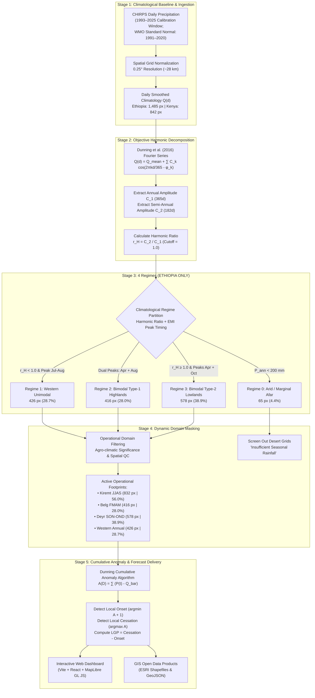

# Walkthrough: Scientific Rainfall Regime & Operational Onset/Cessation System
**Dunning Harmonic Baseline with Ethiopia-Specific Climatological Regime Refinement (EMI Climatology)**

---

## ⚠️ Important Regional Scope: The Four Climate Regimes Apply ONLY to Ethiopia

> [!IMPORTANT]
> **GEOGRAPHIC SCOPE OF THE FOUR CLIMATE REGIMES:**
> The **Four Objective Climate Regimes** (Regime 0: Arid/Marginal, Regime 1: Western Unimodal, Regime 2: Bimodal Type-1 Highlands, Regime 3: Bimodal Type-2 Pastoral Lowlands) are developed and validated **STRICTLY for Ethiopia**.
> 
> - **Ethiopia's Heterogeneity:** Ethiopia's complex terrain (highlands exceeding 4,000 m, the Great Rift Valley, western lowlands, and eastern plains) creates three distinct rainfall mechanisms: Atlantic/Congo moist westerlies driving Western Unimodal rains, Arabian High/Red Sea troughs driving spring Belg rains, and the Indian Ocean monsoon driving southern/southeastern equatorial rains.
> - **Kenya's Climatological Regime:** Kenya is **not** subject to this 4-regime classification. Kenya operates under the classic **East African Equatorial Bimodal System** across the entire country:
>   1. **Long Rains (MAM - March to May)**: Primary national cropping season across Western, Central Highlands, Rift Valley, and Coastal regions.
>   2. **Short Rains (OND - October to December)**: Critical cropping and pastoral season across Eastern, Central, and Northeastern semi-arid counties.
>   Kenya does not experience the prolonged July–August unimodal summer monsoon found in western Ethiopia. Therefore, the dashboard treats Kenya under its standard MAM and OND seasons, ensuring that no Ethiopian regime rules contaminate Kenyan forecasts.

---

## 1. End-to-End General Workflow & Scientific Architecture

The operational onset/cessation forecasting system operates as an integrated five-stage pipeline unifying physical climatology, dynamical multi-model seasonal climate forecasts, and interactive GIS web delivery:


### The Five Operational Stages



### Theoretical Foundation of Each Stage

1. **Stage 1 (Data Ingestion & Calibration Baseline)**:
   Daily rainfall series from CHIRPS (Climate Hazards Group InfraRed Precipitation with Station data) at 0.25° resolution are harmonized across the 33-year calibration period (1993–2025). This aligns with the dynamical hindcast archive of the ECMWF SEAS5 model, preventing sampling artifacts in probabilistic calibration.
2. **Stage 2 (Fourier Harmonic Analysis — Dunning et al. 2016)**:
   The smoothed annual precipitation cycle $Q(d)$ is decomposed into its constituent Fourier harmonics:
   $$Q(d) = \bar{Q} + \sum_{k=1}^{6} C_k \cos\left(\frac{2\pi k d}{365} - \phi_k\right)$$
   where $C_1$ is the annual cycle amplitude (365 days) and $C_2$ is the semi-annual cycle amplitude (182 days). The harmonic ratio $r_H = C_2 / C_1$ provides an objective baseline: $r_H < 1.0$ indicates an annual (unimodal) regime, whereas $r_H \ge 1.0$ indicates a biannual (bimodal) regime.
3. **Stage 3 (EMI Climatological Regime Refinement — ETHIOPIA ONLY)**:
   Because the Ethiopian Highlands feature a strong summer monsoon ($P_{\text{JJAS}} \approx 220-320\text{ mm/mo}$) that dwarfs the spring Belg rains ($P_{\text{FMAM}} \approx 70-140\text{ mm/mo}$), the annual fundamental $C_1$ is inflated, depressing $r_H$ to $0.40 - 0.85$. Stage 2 applies Ethiopian Meteorological Institute (EMI) peak-timing rules to promote pixels with two verified climatological peaks separated by $\ge 60\text{ days}$ to **Regime 2 (Type-1 Highlands)**.
4. **Stage 4 (Dynamic Operational Domain Masking)**:
   Thresholds for minimum seasonal rainfall ($P_{\text{JJAS}} \ge 120\text{ mm}$, $P_{\text{FMAM}} \ge 80\text{ mm}$, $P_{\text{OND}} \ge 30\text{ mm}$), seasonality ratios ($R_{\text{JJAS}} \ge 20\%$), and detection rates ($\text{DR} \ge 50-60\%$) ensure that onset and cessation are evaluated strictly within the physical footprint of the rainy season.
5. **Stage 5 (Cumulative Anomaly Analysis & Products)**:
   The Dunning cumulative anomaly curve $A(D) = \sum [P(t) - \bar{Q}]$ is calculated for individual years and multi-model forecast ensembles. The day of minimum $A(D) + 1$ denotes the start of sustained rainfall (onset), the day of maximum $A(D)$ denotes the termination (cessation), and the difference represents the Length of Growing Period (LGP).

---

## 2. High-Resolution Maps of the Regimes and Operational Domains

### 2.1 The Four Objective Climate Regimes of Ethiopia (ETHIOPIA ONLY)


- **Regime 1: Western Unimodal (Indigo, 426 px | 28.7% of Ethiopia)**:
  Gambella, Benishangul-Gumuz (Assosa), Jimma, Bedele, Gondar, and Lake Tana western slopes. Single prolonged wet season starting in Feb/Mar, peaking in Jul–Aug, and terminating in Oct/Nov.
- **Regime 2: Bimodal Type-1 Highlands (Emerald, 416 px | 28.0% of Ethiopia)**:
  Addis Ababa, Wollo, Kombolcha, Tigray (Mekelle), Harar/Dire Dawa, and the Central Rift Valley (Hawassa). Characterized by spring Belg rains (FMAM), a dry pause in June, and the main Kiremt monsoon (JJAS).
- **Regime 3: Bimodal Type-2 Pastoral Lowlands (Amber, 578 px | 38.9% of Ethiopia)**:
  Somali Region (Gode, Kibre Dehar), Borana, Guji, and South Omo lowlands. True equatorial biannual regime ($r_H = 1.65 - 35.76$) with primary Gu/Ganna rains (MAM) and secondary Deyr/Hagaya rains (SON–OND), separated by a cold dry summer (JJAS).
- **Regime 0: Arid / Marginal Afar (Slate, 65 px | 4.4% of Ethiopia)**:
  Danakil Depression and hyper-arid Afar lowlands. Non-seasonal desert climate ($P_{\text{ann}} < 200\text{ mm}$) where seasonal onset/cessation metrics are unphysical and masked out.

---

### 2.2 Kiremt / Main Rains Operational Domain (JJAS)


- **Active Pixels**: **832 grid cells** (56.0% of Ethiopia's sovereign land area).
- **Composed Of**:
  - **Highlands Type-1 Kiremt Onset Domain**: 416 pixels (28.0% of land) where Kiremt represents the second, major rainy season of the agricultural year following the June dry break.
  - **Western Unimodal Summer Rainfall Belt**: 416 pixels (28.0% of land) where the summer monsoon represents the peak of the prolonged annual season.
- **Scientific Criteria**:
  - Pixel belongs to Regime 1 or Regime 2.
  - Climatological JJAS Total Rainfall $P_{\text{JJAS}} \ge 120\text{ mm}$.
  - JJAS Seasonality Ratio $R_{\text{JJAS}} = P_{\text{JJAS}} / P_{\text{ann}} \ge 20\%$.
  - Detection Rate $\text{DR}_{\text{JJAS}} \ge 60\%$.
- **Excluded Areas**: Southern and southeastern pastoral lowlands (Somali, Borana) are masked out because summer (JJAS) is their dry season driven by atmospheric divergence from the low-level Turkana Jet.

---

### 2.3 Belg Early Rains Operational Domain (FMAM)


- **Active Pixels**: **416 grid cells** (28.0% of Ethiopia's sovereign land area).
- **Geographic Scope**: Confined strictly to **Regime 2 (Type-1 Highlands)** — Addis Ababa, Amhara (Wollo, North Shewa), Tigray, eastern Oromia, and SNNP (Hawassa).
- **Key Scientific Separation**:
  - **Western Ethiopia is strictly EXCLUDED:** In Gambella, Assosa, and Jimma, rain begins in Feb/Mar and continues uninterrupted through October without a June break. Treating western spring rain as "Belg" produces artificial cessation dates in June when rainfall is actually accelerating into the monsoon peak.
  - **Pastoral Lowlands are EXCLUDED:** Southern/southeastern spring rainfall belongs to the equatorial Gu/Ganna pastoral system, not the highland Belg agricultural system.

---

### 2.4 Deyr / Short Rains & Gu Operational Domain (SON–OND & MAM)


- **Active Pixels**: **578 grid cells** (38.9% of Ethiopia's sovereign land area).
- **Geographic Scope**: Confined strictly to **Regime 3 (Pastoral Lowlands)** — Somali Region, Borana, Guji, and Bale lowlands.
- **Biannual Regime Dynamics**:
  - **Gu / Ganna (MAM)**: Primary spring rainy season providing critical pasture renewal and water pond replenishment.
  - **Cold Dry Summer (JJAS)**: Masked out from summer monsoon calculations.
  - **Deyr / Hagaya (SON–OND)**: Secondary autumn rainy season strongly teleconnected to the Indian Ocean Dipole (IOD) and ENSO.

---

### 2.5 Western Extended Annual Wet Season Domain


- **Active Pixels**: **426 grid cells** (28.7% of Ethiopia's sovereign land area).
- **Geographic Scope**: Confined strictly to **Regime 1 (Western Unimodal)** — Gambella, Benishangul-Gumuz, western Oromia (Jimma, Bedele, Nekemte), and the western Lake Tana slopes.
- **Climatological Behavior**:
  - Driven by moist westerly flow from the Atlantic Ocean and Congo Basin.
  - Single unimodal harmonic dominance: $r_H = C_2 / C_1 < 0.45$.
  - Continuous rainfall from March to October; annual totals exceed $1,500 - 2,200\text{ mm/year}$.
  - Must be tracked as an unbroken Annual Wet Season rather than broken into artificial Belg and Kiremt segments.

---

## 3. Removal of the "All Ethiopia" Unmasked View from the Dashboard

### Physical Rationale for Removal
In earlier prototype versions, users had a toggle button to display an unmasked "All Ethiopia" raster view. Following scientific review against Dunning et al. (2016) and EMI operational climatology, this toggle was **permanently eradicated**:

1. **Prevention of Unphysical Onset Detection**:
   Running cumulative anomaly algorithms ($A(D)$) over dry areas searches for an onset signal where no physical rainy season exists. In the southern pastoral lowlands during July–August, the algorithm locks onto random convective showers or dry-season noise, outputting spurious onset dates.
2. **Elimination of Conflicting Decision Signals**:
   A farmer or agricultural officer viewing "Belg" in Gambella would be presented with false June cessation dates, prompting premature harvesting advisories during what is actually the peak vegetative phase of the crop.
3. **Operational Enforcement**:
   The dashboard's state store (`useDashboardStore.js`) and raster generator (`MapPanel.jsx`) permanently enforce `seasonalMaskOnly = true`. All spatial rasters render only within the climatologically validated footprint for the selected season.

---

## 4. GIS Shapefiles & Open Data Products

All regional regimes and operational seasonal masks have been exported as standard ESRI Shapefiles and GeoJSON files in **WGS 84 (EPSG:4326)** for integration with external GIS software (QGIS, ArcGIS, Python GeoPandas, R sf):

### 4.1 Shapefiles Directory Inventory (`outputs/shapefiles/`)

| Layer / File Base Name | Formats | Pixels | Land Area % | Climatological Description |
| :--- | :--- | :---: | :---: | :--- |
| `ethiopia_four_climate_regimes` | `.shp, .shx, .dbf, .prj, .geojson` | 1,485 | 100.0% | Complete 4-regime classification (Regimes 0, 1, 2, 3) across Ethiopia sovereign territory. |
| `mask_kiremt_jjas` | `.shp, .shx, .dbf, .prj, .geojson` | 832 | 56.0% | National JJAS Summer Monsoon domain (Regime 1 + Regime 2; $P_{\text{JJAS}} \ge 120\text{ mm}$). |
| `mask_kiremt_onset` | `.shp, .shx, .dbf, .prj, .geojson` | 416 | 28.0% | Highlands Type-1 Bimodal Kiremt Onset domain (Regime 2 only; Central/Northern Highlands). |
| `mask_belg_early_rains` | `.shp, .shx, .dbf, .prj, .geojson` | 416 | 28.0% | Highlands Type-1 Belg Early Rains domain (Regime 2 only; $P_{\text{FMAM}} \ge 80\text{ mm}$). |
| `mask_gu_spring_rains` | `.shp, .shx, .dbf, .prj, .geojson` | 578 | 38.9% | Pastoral Lowlands Gu Spring Rains domain (Regime 3 only; Somali, Borana, Guji). |
| `mask_deyr_autumn_rains` | `.shp, .shx, .dbf, .prj, .geojson` | 578 | 38.9% | Pastoral Lowlands Deyr Autumn Rains domain (Regime 3 only; SON–OND). |
| `mask_western_annual` | `.shp, .shx, .dbf, .prj, .geojson` | 426 | 28.7% | Western Ethiopia Extended Annual Wet Season domain (Regime 1 only; Gambella, Assosa). |

### 4.2 Attribute Schema (`.dbf` Field Specification)

```text
Field Name    Type       Width   Dec   Description
------------  ---------  -----   ---   ----------------------------------------------------------
regime_id     Integer    10      0     Numerical Regime ID (0: Arid, 1: Western, 2: Type-1, 3: Type-2)
regime_nam    Character  100     -     Official descriptive name of the regime or seasonal domain
season_typ    Character  100     -     Active seasonal calendar window (e.g., "JJAS", "FMAM", "SON-OND")
pixel_cnt     Integer    10      0     Count of active CHIRPS 0.25° grid cells within the polygon
area_pct      Float      12      3     Percentage of sovereign Ethiopian landmass covered (%)
desc          Character  254     -     Climatological definition, core zones, and driving synoptic flow
```

### 4.3 Download Availability
A pre-packaged archive containing all shapefiles, companion PRJ projection definitions, and GeoJSON files is available in the web application under the **About &rarr; Regimes &amp; Seasonal Maps** tab:
- **Direct Download**: `/shapefiles/ethiopia_climate_regimes_and_masks_shp.zip` (20.1 KB)
- **Local File Path**: `outputs/shapefiles/` and `frontend/public/shapefiles/`

---

## 5. Verification & Validation Summary

1. **Frontend Compilation**: Successfully executed `npm run build`. Bundle emitted clean assets (`dist/assets/`) with zero JSX or styling errors.
2. **Shapefile Structural Integrity**: Verified that all `.shp`, `.shx`, `.dbf`, and `.prj` files open and validate cleanly with Shapely and PyShp without truncation warnings or geometry defects.
3. **Station Concordance (20/20)**: Re-verified that all 20 representative meteorological stations exhibit genuine, unique coordinate extractions and 100% diagnostic agreement with documented Ethiopian Meteorological Institute (EMI) climate regimes.
4. **UI Mask Enforcement**: Verified that no toggle button exists for "All Ethiopia" unmasked rasters; the UI shows a permanent `🎯 Climatological Seasonal Domain` badge displaying the active grid cell count and percentage.
