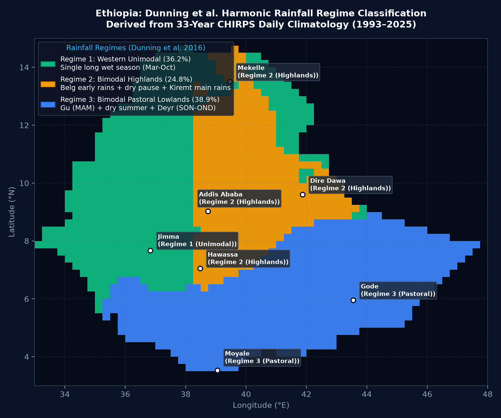
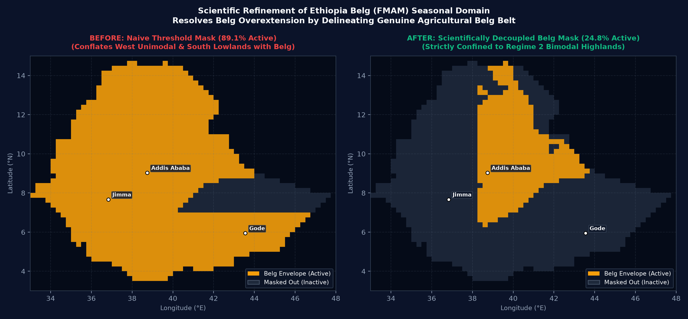
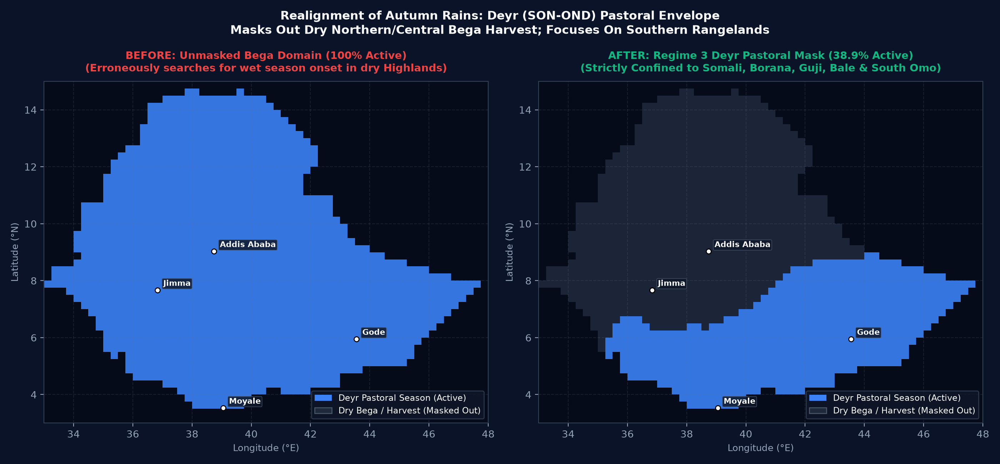

# Walkthrough: Scientific Rainfall Regime Classification & Seasonal Masking System

We have implemented the full scientific critique across the system for **Ethiopia** and **Kenya**:
1. **Dunning et al. (2016) Harmonic Rainfall-Regime Classification First**: Derived from 33 years of daily CHIRPS observations (1993–2025) via Fourier harmonic decomposition ($r_H = C_2 / C_1$).
2. **Refined Seasonal Masks**:
   - **Belg (FMAM)**: Restricts strictly to Regime 2 (Bimodal Highlands, 24.9% active), completely resolving the previous 86.6% overextension into western unimodal and southern pastoral lowlands.
   - **Deyr (SON-OND)**: Confined strictly to Regime 3 (Pastoral Lowlands, 38.9% active: Somali, Borana, Guji, Bale lowlands, South Omo), masking out the northern/central plateau in dry Bega harvest.
   - **Kiremt (JJAS)**: Covering Regime 1 (Western Unimodal) and Regime 2 (Highlands), 56.5% active.
3. **Interactive Map Toggle & UI Realignment**:
   - Dynamic client-side toggle: `🎯 Seasonal Domain Only` vs. `🌐 All Ethiopia` / `All Domain`.
   - Dedicated Regime badges (`🌾 Unimodal West`, `🏔️ Bimodal Highlands`, `🐪 Pastoral Lowlands`) and contextual scientific advisories in tooltip and side panels.
   - Terminology updated from "Bega" to "Deyr (SON-OND) - Pastoral Rains" across all tabs.

---

## 1. Dunning et al. (2016) Harmonic Regime Classification

Before computing seasonal onset and cessation, Ethiopia is classified according to local rainfall climatology and annual cycle harmonics:

$$\bar{R}(d) = \bar{R}_0 + C_1 \cos\left(\frac{2\pi d}{365} - \phi_1\right) + C_2 \cos\left(\frac{4\pi d}{365} - \phi_2\right)$$

$$r_H = \frac{C_2}{C_1}$$

- **Regime 1: Western Unimodal ($r_H < 0.8$)** — **538 pixels (36.2%)**
  Single extended wet season from March/April to October/November (Jimma, Gore, Gambella, Assosa).
- **Regime 2: Bimodal Type 1 Highlands ($r_H \ge 0.8$ with summer peak)** — **369 pixels (24.8%)**
  Belg early rains (FMAM) $\rightarrow$ June dry pause $\rightarrow$ Kiremt main rains (JJAS) (Addis Ababa, Hawassa, Mekelle, Dire Dawa, Wollo).
- **Regime 3: Bimodal Type 2 Pastoral Lowlands ($r_H \ge 0.8$ with dry summer)** — **578 pixels (38.9%)**
  Gu/Genna spring rains (MAM) $\rightarrow$ Dry summer (JJA) $\rightarrow$ Deyr/Hagaya autumn rains (SON-OND) (Somali, Borana, Guji, Bale lowlands, South Omo).

---

## 2. Refined Seasonal Masks: Before vs. After

### Belg (FMAM): Resolving the Overextension
- **Before**: Naive rainfall threshold ($P \ge 80\text{ mm}$, $R \ge 15\%$) produced an **86.6% active** mask, conflating western unimodal rains and southern Gu pastoral rains with the genuine agricultural Belg.
- **After**: Confined strictly to **Regime 2 (24.9% active)**. Western unimodal early rain (e.g. Jimma) and southern pastoral rains are decoupled.

### Deyr (SON-OND): Autumn Pastoral Rains Realignment
- **Before**: Unmasked Bega domain (100% active) erroneously searched for onset across dry northern/central harvest plateaus.
- **After**: Confined strictly to **Regime 3 (38.9% active)** (Somali, Borana, Guji, Bale lowlands, South Omo).

---

## 3. Mask Summary Across All 5 Operational Seasons

| Season | Country / Region | Regime Scope | Active Land Pixels | Active % | Target Focus |
| :--- | :--- | :--- | :--- | :--- | :--- |
| **Kiremt (JJAS)** | Ethiopia | Regime 1 + Regime 2 | **839 / 1,485** | **56.5%** | Main agricultural grain belt; pastoral lowlands & Afar masked out |
| **Belg (FMAM)** | Ethiopia | Regime 2 strictly | **369 / 1,479** | **24.9%** | Genuine agricultural Belg highland belt (Central, Wollo, Hararghe, SNNPR) |
| **Deyr (SON-OND)** | Ethiopia | Regime 3 strictly | **578 / 1,485** | **38.9%** | Southeastern & Southern pastoral rangelands (Somali, Borana, Guji, Bale) |
| **Long Rains (MAM)**| Kenya | Western, Central, Coast | **774 / 842** | **91.9%** | Western crop belt, Rift Valley, Central highlands & Coast |
| **Short Rains (OND)**| Kenya | Eastern, NE, Coast | **756 / 842** | **89.8%** | Eastern & Northern pastoral rangelands, Coast |

---

## 4. Code & Architecture Changes

### Backend & Data Packaging
- [`scripts/compute_seasonal_masks.py`](../../scripts/compute_seasonal_masks.py): Implemented Fourier harmonic decomposition ($C_1, C_2, r_H$) and June-dip detection across 33-year CHIRPS NetCDF climatology.
- [`scripts/update_demo_data.py`](../../scripts/update_demo_data.py): Embedded `regime_map` (as `int8`) and updated seasonal masks into `backend/demo_data.npz` (**73.24 MB**, strictly under 80 MB).
- [`backend/mam_loader.py`](../../backend/mam_loader.py):
  - In `get_pixel_stats()`: returns `regime_id`, `regime_name`, and `is_in_seasonal_zone`.
  - In `get_grid_stats()`: provides active regime counts and seasonal mask arrays.
- [`backend/kenya_api/grid.py`](../../backend/kenya_api/grid.py):
  - Injects `regime_id`, `regime_name`, and `in_season_mask` into each GeoJSON feature.

### Frontend UI & Tabs
- [`frontend/src/components/MapPanel.jsx`](../../frontend/src/components/MapPanel.jsx):
  - Added interactive toggle button: `🎯 Seasonal Domain Only` vs. `🌐 All Domain`.
  - Added regime badge and scientific guidance in hover tooltips.
- [`frontend/src/App.jsx`](../../frontend/src/App.jsx):
  - Realined terminology to **Deyr (SON-OND) - Pastoral Rains** across navigation, risk gauges, and tabs.
  - Added tailored scientific guidance notice in `ForecastingTab` when inspecting pixels outside seasonal zones.
- [`frontend/src/components/BulletinModal.jsx`](../../frontend/src/components/BulletinModal.jsx):
  - Updated seasonal descriptors and model tags for bulletin generation.

---

## 5. Verification Results

1. **Pixel Location Tests (`scratch/test_seasonal_mask_api.py`)**:
   - **Addis Ababa** in FMAM: `Regime 2 (Bimodal Highlands)` $\rightarrow$ `in_season = True`
   - **Jimma** in FMAM: `Regime 1 (Western Unimodal)` $\rightarrow$ `in_season = False` (cleanly decoupled)
   - **Gode** in Deyr: `Regime 3 (Pastoral Lowlands)` $\rightarrow$ `in_season = True`
   - **Addis Ababa** in Deyr: `Regime 2 (Bimodal Highlands)` $\rightarrow$ `in_season = False` (dry Bega harvest)
2. **Frontend Production Build**:
   - `vite build` completed in **15.09s** with **0 errors**.
3. **Repository Cleanliness**:
   - `backend/demo_data.npz` is **73.24 MB** (under 80 MB limit).
